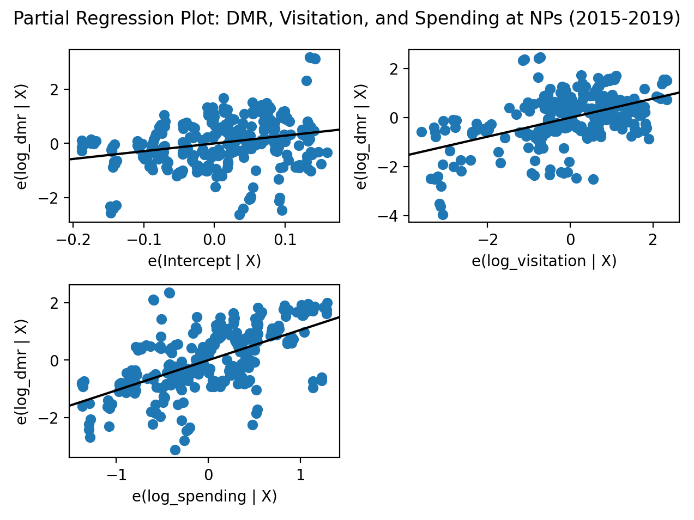

# project-parks-pulse

# Description
National parks in the United States, often hailed as "America's best idea," have seen a notable surge in interest in recent years. This project aims to develop a comprehensive measure of individual park health, known as the Park Health Index (PHI), by analyzing the U.S. National Parks System (NPS) and other publicly available datasets. The PHI will consider various factors such as park usage, climate data, management practices, and potential hazards, assigning appropriate weights to each to provide a holistic view of a park's current condition.

Furthermore, this project seeks to analyze trends in park visitation and the impact of climate change over a 10-year period (2011-2022) to offer insights into park management and conservation efforts. 

By achieving these goals, the project aims to (1) raise awareness about the health of national parks, both as a snapshot and over time, (2) uncover patterns useful for assessing and evaluating park management, and (3) provide a benchmark to highlight areas of risk, enabling policymakers to make informed decisions regarding parks conservation and resource allocation.

# Built with
- Python
- matplotlib/Seaborn
- Statsmodels
- Pandas
- Numpy
- BeautifulSoup4
- geopandas
- lxml
- cssselect
- fastkml

# Data Sources
1.	DMR: https://www.pewtrusts.org/
2.	NPS Spending Data: https://www.nps.gov/aboutus/budget.htm
3.	Weather data: https://www.visualcrossing.com/ 
4.	NP Basic Info(name/location/size) Data: https://en.wikipedia.org/wiki/List_of_national_parks_of_the_United_States
5.	NP Visitation Data: https://irma.nps.gov/Stats/SSRSReports/National%20Reports/Annual%20Visitation%20and%20Record%20Year%20by%20Park%20(1904%20-%20Last%20Calendar%20Year)

# Getting Started
To get started with the Dashboard, follow these steps:
1.	Clone the repository: "git clone https://github.com/SeongyeonYang/30122-project-parks-pulse.git"
2.	Run "poetry install" to install the necessary packages
3.	Run "poetry shell" to activate the virtual environment
4.	Run "python -m ppp" to open the visualization and analysis

# Project Directory Structure
- ppp
  - analysis
    - visualizations
    - app.py
    - .py files about analysis (total 6)
  - cleaning
    - cleaned_data
      - cleaned_time_series_all.csv (all merged files based on time series)
      - cleaned_nps_info.csv (all merged files based on information)
      - .py files about cleaned data before merge into 2 files above (total 14)
      - .py files about factor_ratio in 2015 and 2019 (total 4)
    - raw_data
      - climate
      - nps_spending
      - dmr-2015-2019.csv
      - dmr-2023.csv
      - npca-orphaned-wells.csv
      - nps-boundary.geojson
      - nps-nightsky-monitoring.kml
      - nps-parkcode.csv

# Data Visualization Demo
- Correlation Matrix of Visitation, Spending, and Climate Variables (2011-2022)

- Partial Regression Plot: DMR, Visitation, and Spending at NPs (2015-2019)

# Authors
- Minh Nghiem 
- Seongyeon Yang 
- Yi-Huai Chang 
- Diyanet Nijiati 

